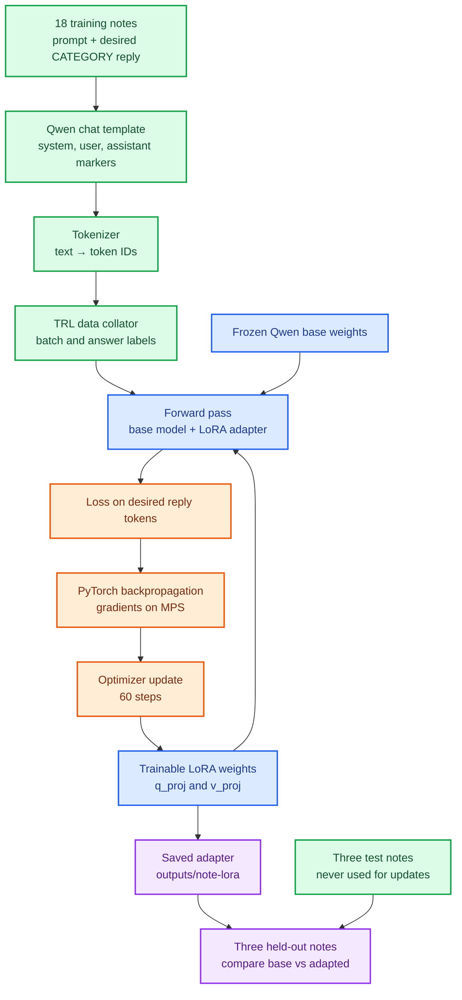
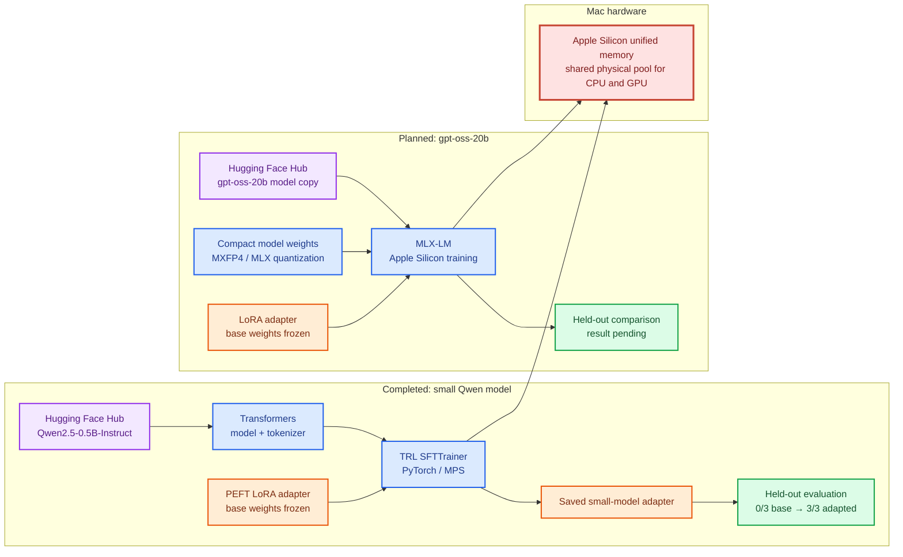

# Visual map of the learning path

## Exercise 1: the completed Qwen + TRL training loop

## Two frameworks on one Apple Silicon Mac

The left side is the **verified exercise in this repository**. The right side is the **planned next exercise**; its code and results will be added after the learner runs it.

An Ollama `gpt-oss:20b` installation is a separate inference copy. The later MLX training path will obtain compatible weights from Hugging Face.
