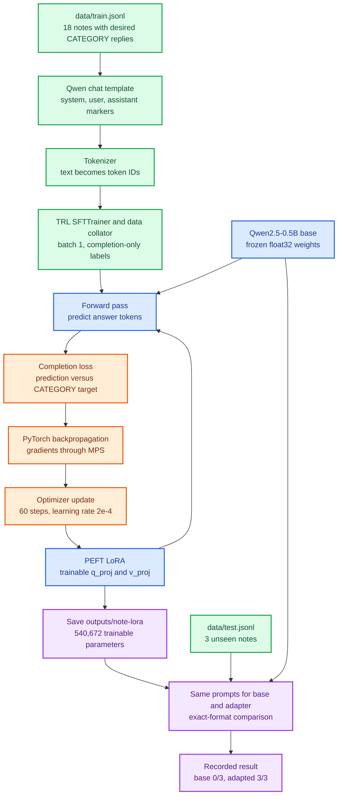
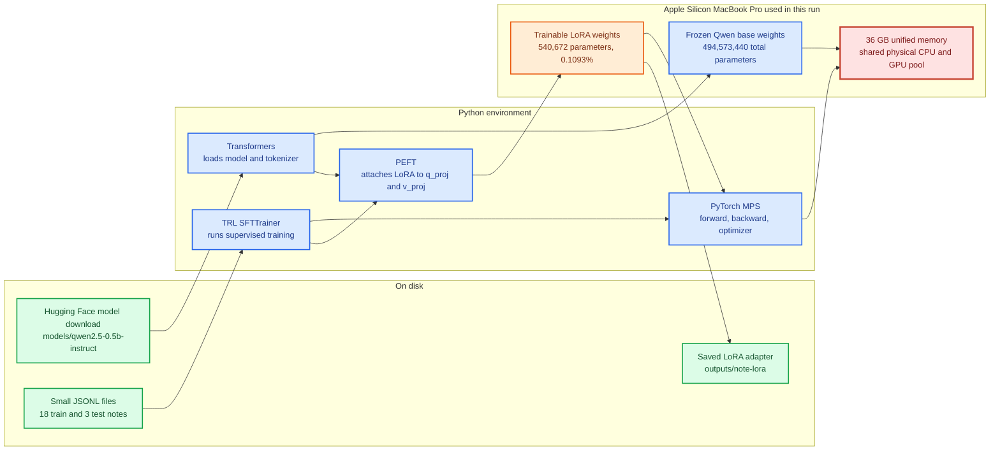

# Mermaid maps: Qwen + Transformers + TRL

These diagrams follow the code and 18/3 note split in this repository. Green nodes prepare data, blue nodes hold the model or framework, orange nodes update weights, purple nodes show the saved result, and red marks the Mac hardware.

## 1. From notes to a tested LoRA adapter

The test notes never contribute gradients. The 3/3 score describes these three notes in one run, not performance on every possible note.

## 2. What occupies the Mac during training

`outputs/note-lora` stores the learned adjustments; it still needs the downloaded base model for inference. The 36 GB figure is the configuration used in the recorded run, not a measured minimum.
